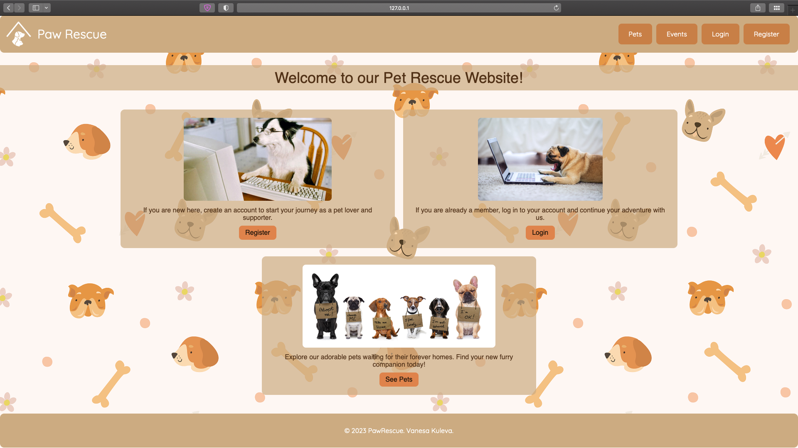

# Paw Rescue - Connecting Animals with Loving Homes


Welcome to Paw Rescue! Our mission is to connect animals in need with caring families. Paw Rescue is a Django Web App designed to facilitate the adoption and fostering of animals, providing a platform where users can discover adorable pets awaiting their forever homes.

Paw Rescue offers a range of features to provide a comprehensive platform for animal adoption and fostering, as well as pet-related events:


- **User-friendly Adoption and Fostering Platform:** Explore our intuitive interface designed to make the process of adopting or fostering a pet straightforward and enjoyable.


- **Submit Adoption and Fostering Applications Online:** Fill out adoption and fostering applications conveniently through our platform. Once submitted, our dedicated team reviews the applications to ensure each pet finds a suitable and loving home.


- **Interactive Admin Panel:** For administrators, our interactive admin panel offers powerful tools to manage animals, applications, and other essential aspects of the platform. This allows for efficient communication and decision-making in the adoption and fostering process.


- **Events Page:** Stay engaged with the pet-loving community by exploring our events page. Here, users can discover and even contribute to various pet-related events in their area. Whether it's adoption drives, fundraisers, or educational workshops, our events page keeps users informed about the latest happenings.


- **Responsive Design for Optimal User Experience:** Our platform is designed to adapt seamlessly to various devices, ensuring that users can access the Paw Rescue features from their desktops, tablets, or smartphones.


## Installation

Follow these steps to set up and run the Paw Rescue Django web app on your local machine:

1. **Clone the Repository:** Start by cloning this repository to your local machine using Git:
   ```bash
   git clone https://github.com/vanesakuleva/PawRescue.git
   
2. Navigate to the Project Directory: Change your working directory to the project folder:
   ```bash
   cd PawRescue

Create and Activate Virtual Environment (Optional but Recommended): Create and activate a virtual environment:
bash
Copy code
pip install virtualenv
virtualenv venv
source venv/bin/activate   # On macOS and Linux
venv\Scripts\activate      # On Windows
Install Dependencies: Install the project dependencies:
bash
Copy code
pip install -r requirements.txt
Apply Database Migrations: Apply necessary database migrations:
bash
Copy code
python manage.py makemigrations
python manage.py migrate
Create a Superuser (Optional but Recommended): Create a superuser account for admin access:
bash
Copy code
python manage.py createsuperuser
Run the Development Server: Start the Django development server:
bash
Copy code
python manage.py runserver
Access the App: Open a web browser and go to http://127.0.0.1:8000/ to see the Paw Rescue web app.


## Technologies

- Django
- HTML, CSS
- PostgreSQL
- Bootstrap


[//]: # (## Demo)

[//]: # ()
[//]: # (For a live demonstration of the Paw Rescue platform, visit our live demo at [http://pawrescue-demo.com/]&#40;http://pawrescue-demo.com/&#41;.)

## License

This project is licensed under the MIT License.

## Screenshots



